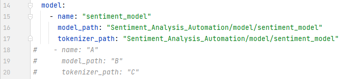

# SentHive
**Aggregate. Summarize. Understand.**


---

## Overview
SentHive is a lightweight pipeline for sentiment labeling, aggregation, and summarization.  
It helps you quickly analyze large-scale chat/text datasets and generate concise, AI-driven summaries.

---

## Features
- Label massive text datasets with sentiment (positive, negative, neutral)
- Aggregate text data according to custom labels
- Generate concise summaries using AI
- Support text cleaning with `Regularization_removal.py`  
- Organize and store multiple projects under `Demand_nanlysis_data`

## Directory Structure
```angular2html
## Directory Structure
SentHive/
├─ Demand_analysis_data/
│  ├─ Project1/
│  │  └─ Dataset/xxx.csv
│  ├─ Project2/
│  │  └─ Dataset/xxx.csv
├─ Sentiment_Analysis_Automation/
│  ├─ utils/
│  │  ├─ Labeler.py
│  │  ├─ SentimentStats.py
│  │  ├─ keyword_cluster.py
│  │  ├─ ai_summary.py
│  │  ├─ pipeline.py
│  │  └─ logger_utils.py
│  ├─ script/
│  │  ├─ xlsx_to_csv_and_drop_col.py
│  │  ├─ Regularized_matching.py
│  │  └─ Regularization_removal.py
│  ├─ model/
│  │  ├─ sentence_transformer_model/
│  │  └─ sentiment_model/
│  └─ vocabulary/
│     ├─ daily_expressions.txt
│     └─ hit_stopword.txt
├─ misc/picture/SentHive.jpg
└─ requirements.txt
```

## Directory Explanation

### Demand_analysis_data
  Use this folder to store multiple project directories.
  For example, if you work on Task1, create a `Project1/` folder and put all related datasets inside it.
  Save any modifications, additions, or processed files directly in the same folder.
  When you start a new task, create another folder such as `Project2/` or `Project3/`.
  You can specify the active project in the YAML configuration file.
  
### utils

- **Labeler.py**
  Use your own sentiment labeling model(s) to tag text.
  - You need to configure your own model(s) inside this file (support multiple models).
  - Follow the provided format (details left for later documentation).
  
- **SentimentStats.py**
  After labeling, this script processes the text and groups it by the specified label column.
  - It counts the number of texts per label.
  - It also computes the number of **unique users** (non-repeated `player_id`) per label.
  
- **keyword_cluster.py**
  Perform text cleaning and similarity-based clustering.
  - Groups similar text together by semantic similarity.
  - Produces a dictionary: **{key phrase -> number of users}**
  - Converts the final dictionary into a DataFrame for later steps.
  
- **ai_summary.py**
  Generate concise summaries using a large language model (LLM).
  - Takes the DataFrame from `keyword_cluster.py`.
  - Concatenates rows into limited-length text chunks.
  - Sends them to your configured LLM for summarization.
  - You must configure your own LLM here

- **pipeline.py**
  The **main entry point** of the program.
  - Input: a CSV/text file.
  - Processing: runs through labeling -> statistics -> clustering -> summarization.
  - Output: the final summarized insights.
  
- **logger_utils.py**
  Records the execution time for each step in the pipeline, helping monitor performance.
  - Provides utility functions or decorators to automatically log function runtimes.
  - Useful for pipeline stages like labeling, statistics, clustering, and summarization.
  
### Script
The `script/` folder contains handy utilities for preprocessing datasets:

- **xlsx_to_csv_and_drop_col.py**
  Convert `.xlsx` files into `.csv` format and drop specified columns.
  
- **Regularization_removal.py**
  Remove rows containing specified keywords from text using regex matching.
  
- **Regularization_matching.py**
  Extract rows containing specified keywords from text using regex matching.
  
### model
This folder stores pre_trained or fine-tuned models required for the pipeline.

- **sentence_transformer_model/**
  Contains the sentence embedding model used for text vectorization.
  
- **sentiment_model/**
  Contains the sentiment classification model used for text labeling

### vocabulary
This folder contains auxiliary text resources for data cleaning and preprocessing.

- **daily_expressions.txt**
  A list of daily expressions used to normalize or filter conversational text.
  
- **hit_stopword.txt**
  The HIT stopword list (Harbin Institute of Technology), used to remove common stopwords during text cleaning.
  
## Quick Start

To help you quickly test this project, we have already included:

- A **vectorization model**: [paraphrase-multilingual-MiniLM-L12-v2](https://huggingface.co/sentence-transformers/paraphrase-multilingual-MiniLM-L12-v2)
- A **sentiment classification model**: [chinese-roberta-wwm-ext](https://huggingface.co/hfl/chinese-roberta-wwm-ext)

Both models are downloaded directly from Hugging Face without any fine-tuning or modification.

For the dataset, we used an **open-source Douban movie comments dataset**: [https://moviedata.csuldw.com](https://moviedata.csuldw.com).
The dataset was originally collected and published by [csuldw/AntSpider](https://github.com/csuldw/AntSpider).
In this project, we selected around **200 comments of the movie "Spirited Away" (千与千寻)** as an example.

*** Usage

1. Configure the file `pipeline.yaml`
   - Set `analysis.ai_name` and `analysis.ai_url` according to your LLM service.
   - Example: We used [Zhipu GLM-4](https://open.bigmodel.cn/) for summarization.

2. If you want to switch to a different LLM:
   - Update the values in `pipeline.yaml`.
   - Modify the function `request_to_model` in `utils/ai_summary.py` to match the new API.
  
3. Run the pipeline:
   ```bash
   python utils/pipeline.py
   ```
   or simply run it inside your IDE.
   (This project does not provide command-line arguments; configuration is managed via YAML.)
   > **Note**
   >
   > - All file paths in this project use **relative paths**.
   >   As long as you maintain the directory structure as described above, the pipeline will work without any additional path modifications.

## Logic Chain Explanation

If you still have patience to read further 😊, here is a detailed explanation of the logic chain and related modules:

### YAML Configuration

The `pipeline.yaml` file defines four main modules:

- **labeler**
- **analysis**
- **keyword_cluster**
- **pipeline**

Each module corresponds to a script inside the `utils/` floder

---

### Overall Pipeline

1. **Raw CSV Input**
   - Start with raw CSV data.
   - If you want to migrate your own dataset, you may need to preprocess it first.
   - You can use the provided script in the `script/` folder (e.g., dropping columns, regex-based filtering/matching), or write your own preprocessing scripts.
  
2. **Labeling (`Labeler.py`)**
   - The YAML file contains a **`model`** field (see image below).
   - The logic supports **multi-model labeling**, i.e. you can configure multiple models for labeling and then aggregate their predictions according to the computation rules defined in the script.
   - In this demo, only **one sentiment model** is used. You can add more models following the same configuration format.
    
   -

3. **Statistics (`SentimentStats.py`)**
   - After labeling, the CSV file is summarized.
   - This step relies on **user IDs**
     - If the same user wrote multiple comments, we care about the **distribution of sentiments per unique user**, not only the total number of text entries.
     - This provides a more accurate view of sentiment at the **user level**.
   - There is also a **`keywords`** configuration:
     - If certain keywords appear in the text, they can be directly mapped to a pre-difined sentiment label.
     - You can customize this mapping as needed.
  
4. **Clustering (`keyword_cluster.py`)**
   - Perform text cleaning, keyword extraction, and similarity-based clustering.
   - Goal: Reduce massive text data into a **key-phrase -> user count dictionary** for easier LLM summarization.
   - Key components:
     - **Keyword extraction**: Uses TextRank algorithm.
     - **Stopwords**: Uses HIT stopword list (Harbin Institute of Technology).
     - **Tokenization**: Uses Jieba by default (for Chinese). For English or other languages, you should switch to a different tokenizer and possibly adjust the logic.
   - **Clustering methods**:
     - `cluster_by_similarity_flexible` provides two versions:
     - **CPU version** -> Processes sentence embeddings row by row (lower memory footprint).
     - **GPU version** -> Processes in chunks on GPU (faster, but requires careful chunk size control to avoid OOM).
   - Recommendation: Choose based on your hardware and dataset size.
  
5. **Summarization (`ai_summary.py`)**
   - The clustered dictionary is sent to the LLM for summarization.
   - Function `truncate_query_string` ensures the query is trimmed to **8192 characters**, since most LLMs cannot handle oversized input.
   - If your LLM supports larger context windows, you may safely modify this function.
  
6. **Pipeline
   - Contains some parameters, but less critical.
   - Example fields:
     - `batch_size`: Controls the batch size used by the sentiment labeling model. (Technically this belongs in `labeler`, but it was placed here initially and left unchanged).
     - `save_csv`, `output_dir`: Control saving of intermediate and final outputs. In the current setup, these are not used, but you can configure them to save the final LLM responses.
    
## Execution Time Logging

The `utils/logger_utils.py` module provides a utility to record the execution time of each step in the pipeline.

- When used, it generates a log file at:
`Sentiment_Analysis_Automation/logs/pipeline.log`
  
- This log tracks the time spent in key stages of the pipeline, including:
- Sentiment labeling
- Sentiment statistics computation
- Keyword cleaning
- Clustering
- AI summarization
- **Important:** By default, the log is **overwritten** each time you run the pipeline.
- Each execution creates a fresh `pipeline.log`, replacing the previous one.
- **Optional:** If you want to **append** to the existing log instead of overwriting it, you can modify the logger parameters in `logger_utils.py` to enable append mode.

This feature is useful to monitor performance and identify potential bottlenecks in the pipeline over time.
  
--- 

##Cluster Algorithm Analysis
A detailed analysis of the cluster algorithm and its optimizations is available in the following blog.
Click the link if you are interested:
[SentHive Blog Analysis](https://vinoryre.blogspot.com/2025/09/blogsenthive_28.html)

